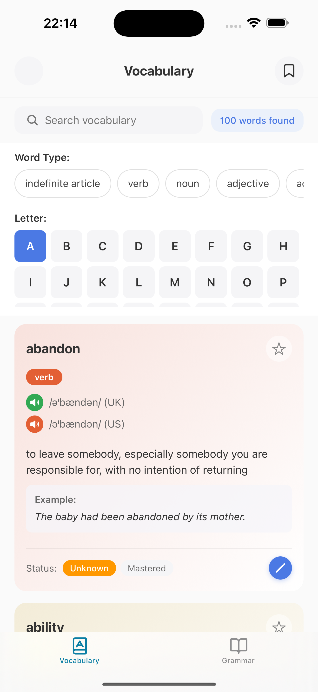
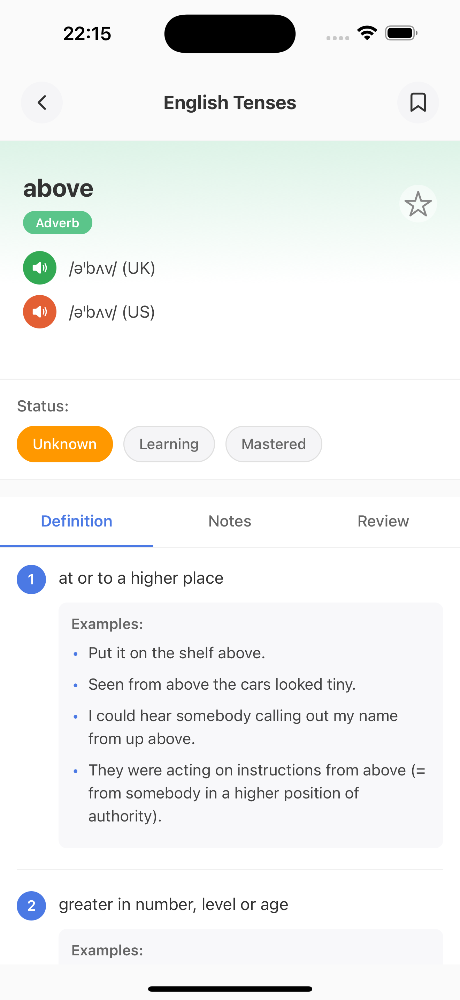
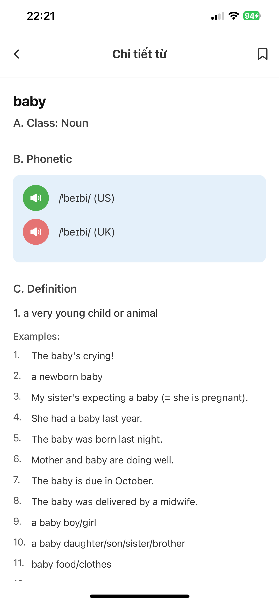
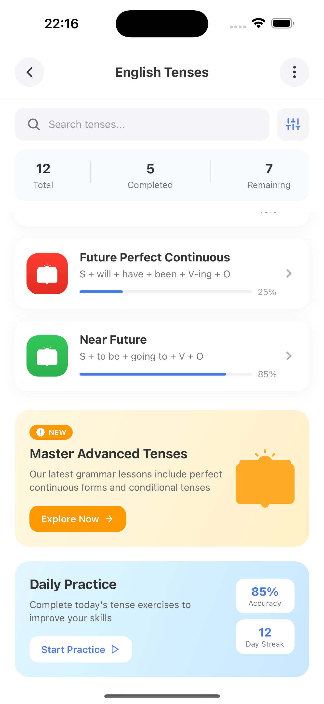
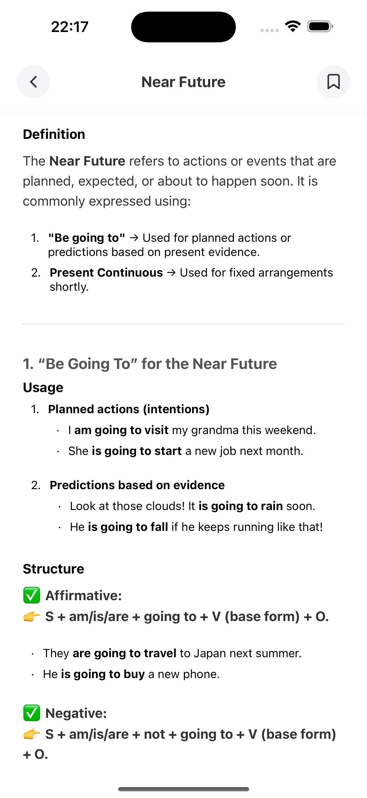
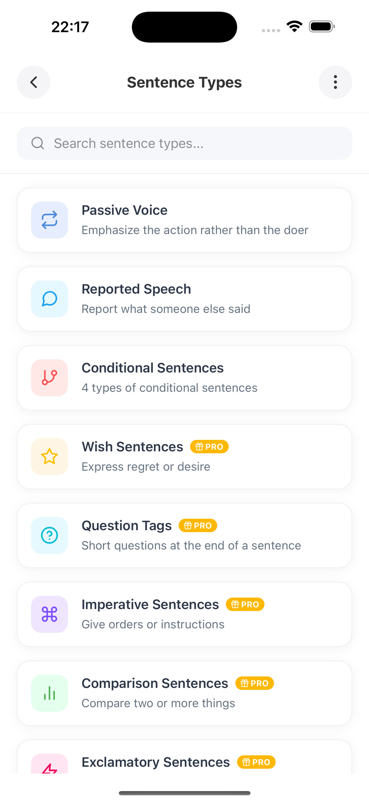
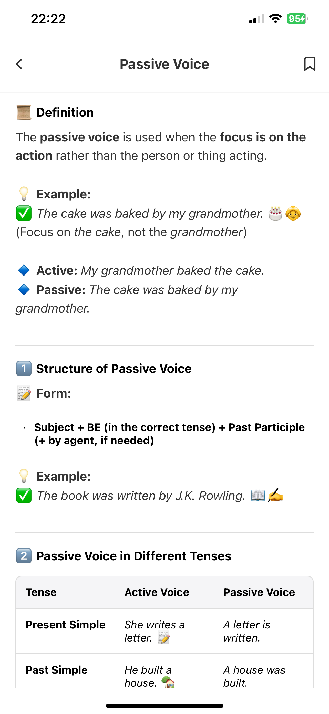
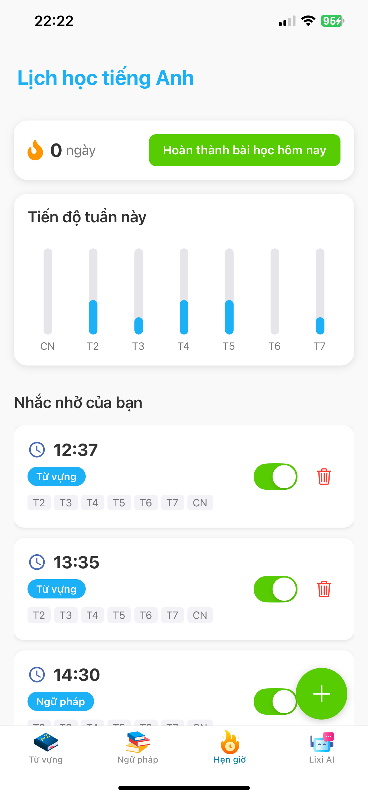
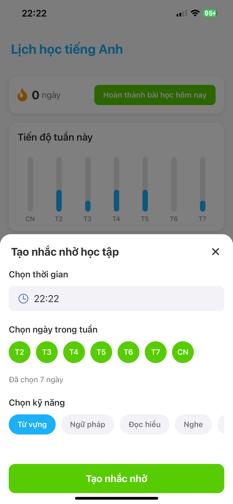
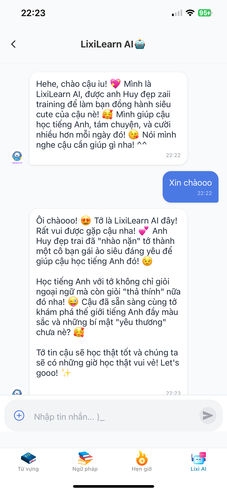

# LixiLearn

**LixiLearn** is a modern English learning app developed with **React Native**, designed to provide an engaging, interactive, and effective experience for language learners at all levels.

## 🚀 Features

- 🎯 **Personalized Learning Paths**  
  Tailored lessons for beginners to advanced learners, covering vocabulary, grammar, listening, and speaking.

- 🧠 **AI-Powered Smart Review**  
  Adaptive review system based on spaced repetition to help learners retain vocabulary effectively.

- 🎤 **Speaking Practice with Voice Recognition**  
  Train your pronunciation using speech recognition and get instant feedback.

- 🎧 **Interactive Listening Exercises**  
  Practice listening skills through real-life conversations and audio clips.

- 📝 **Mini Quizzes & Challenges**  
  Short, fun quizzes to reinforce what you’ve learned and keep you motivated.

- 📱 **Cross-Platform Support**  
  Built using **React Native**, LixiLearn runs smoothly on both Android and iOS devices.

## 💡 Technologies Used

- **React Native** — Cross-platform mobile development framework
- **TypeScript** — Type-safe JavaScript
- **Redux Toolkit** — State management
- **Firebase** — Backend services (authentication, database, storage)
- **React Navigation** — Seamless in-app navigation
- **Expo** — Streamlined development and testing

## 🎯 Target Audience

- English learners from **A1 to B2** levels
- Students preparing for tests (TOEIC, IELTS, CEFR)
- Busy professionals seeking flexible learning options
- Anyone wanting to improve their English communication skills

## 🧭 Roadmap

- [x] MVP: Vocabulary, Grammar, and Listening modules
- [x] Firebase Auth & Realtime Database integration
- [ ] Daily Streaks & Achievement System
- [ ] Offline Mode
- [ ] Native voice assistant integration

## 📸 Screenshots

Here are some screenshots of the LixiLearn app:

     
  
  
  

 

  
  
    
  

 

    
  

## 📬 Contact

For more information, feedback, or partnership inquiries, feel free to reach out:

- 📧 Email: dangquochuy.connect@gmail.com
- 🌐 Website: [www.lixilearn.com](http://www.lixilearn.com)

---

_LixiLearn – Learn English the smart and fun way!_
